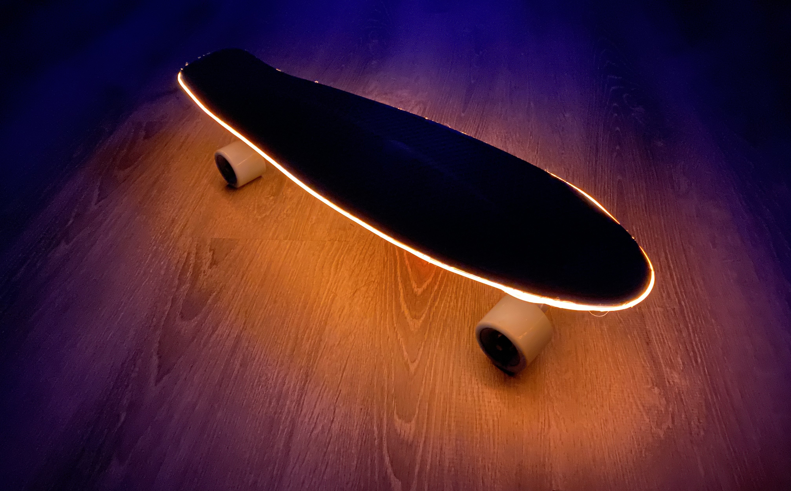
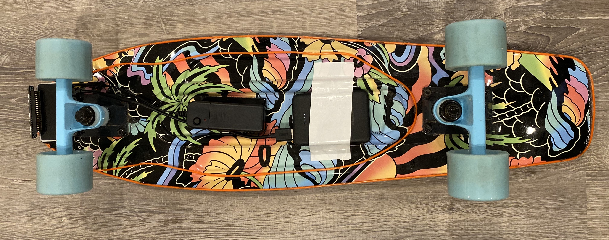
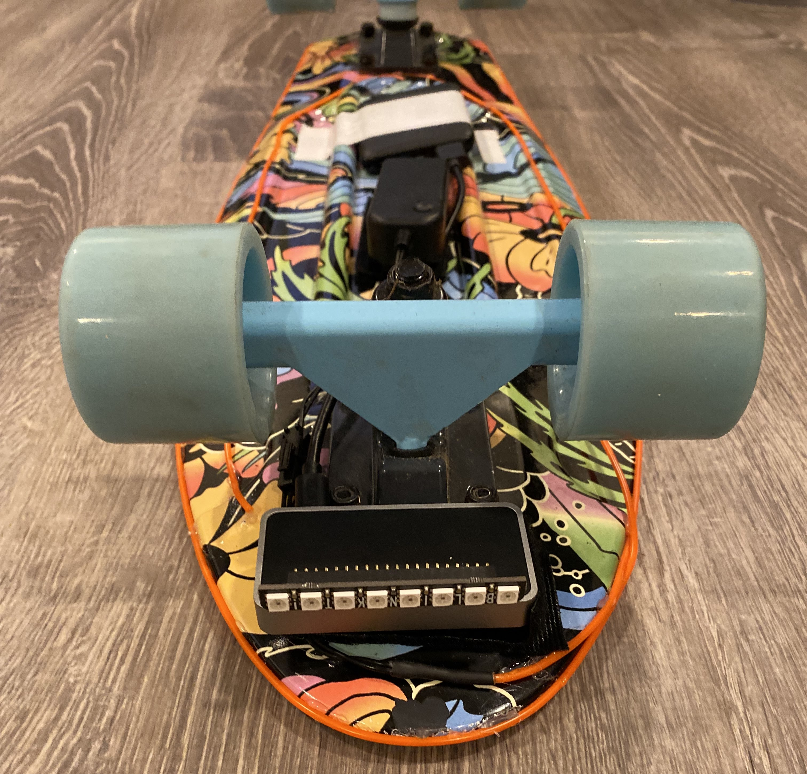

## Raspberry Pi Skateboard

  

This is a simple hack to a skateboard. I attached a Raspi-controlled LED bar and an electro luminescent (EL) wire to it. It makes skateboarding more fun and safer (at night). 

### Equipment

- Raspberry Pi Zero 2W
- [Pimoroni BlinkIt!](https://shop.pimoroni.com/products/blinkt)
- [Right angle GPIO header](https://www.amazon.com/dp/B08GC18NMK)
- [Electro Luminescent (EL) wire](### Hardware Setup)
- [Portable charger](https://www.amazon.com/dp/B082X53VDL/)
- [Flirc Raspi Zero case](https://www.amazon.com/dp/B08837L144)

### Hardware Setup

  
   
  

### Code

See the [code folder](code/) and run [orange-teal-fade.py](code/orange-teal-fade.py). 

### Demo

https://github.com/HSSBoston/skateboard/assets/74394277/b3651035-a788-4097-8406-0e78ca647b7a

https://github.com/HSSBoston/skateboard/assets/74394277/33ecd355-4d08-40e5-8ded-79be09db49d3

