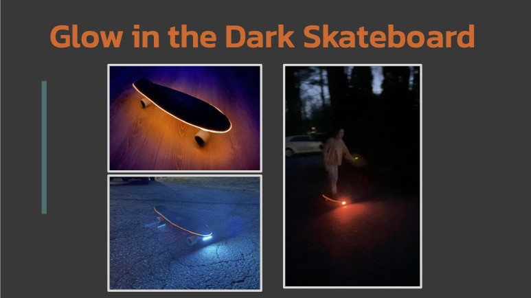

  

This project delivers a hack to make skateboarding more fun and safer. It turns a skateboard to be an Internet-of-Things (IoT) device with a Raspberry Pi and its peripheral components.

Glow in the Dark Skateboard is a "smart" skateboard that has an electroluminescent (EL) wire and LED lights. The lighting pattern changes based on the skateboard's orientation - level, upward, or downward. This is implemented with Python code that continuously runs on a Raspberry Pi to calculate the pitch of the skateboard with an accelerometer. 

This project was submitted to and presented at [PhysTech 2024](https://binnovative-boston.github.io/phystech/2024.html). It won the [Excellence in Creativity award](https://phystech-2024-20890.devpost.com/project-gallery).

## Project History

* [Version 2](https://docs.google.com/presentation/d/1M-zgE1pgPR6p0w8Frr0oSDhFO8sPquiY3voL5hAn7Dk/edit?usp=sharing), June 2024
* [Version 1](https://docs.google.com/presentation/d/1NfC7M3Dkek9KYUD8xchcYe5VzVfrLYgeA9-4y5RsKxc/edit?usp=sharing), March 2024

## Demo

https://github.com/HSSBoston/skateboard/assets/74394277/6715e725-39fc-4ab6-be48-b868e4b46cbb

https://github.com/HSSBoston/skateboard/assets/74394277/33ecd355-4d08-40e5-8ded-79be09db49d3

